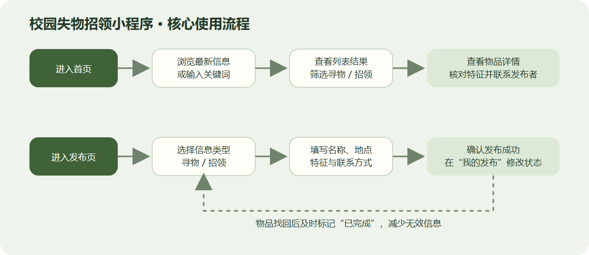
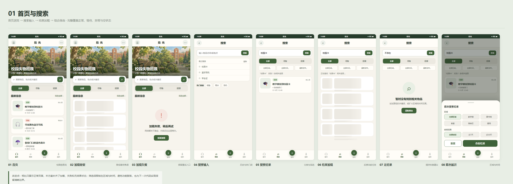
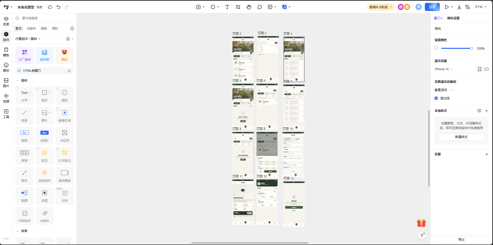
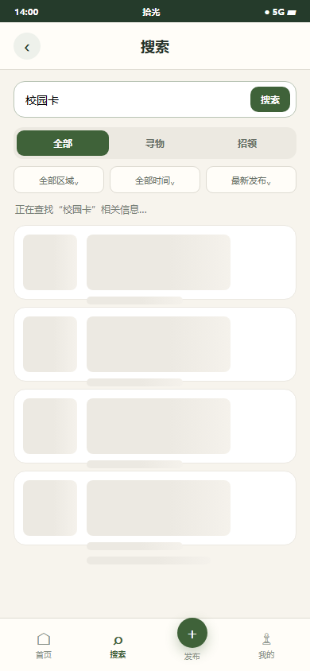
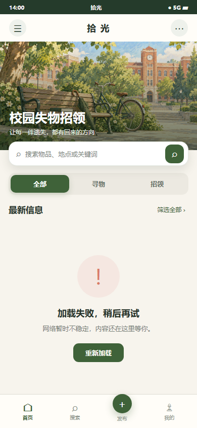
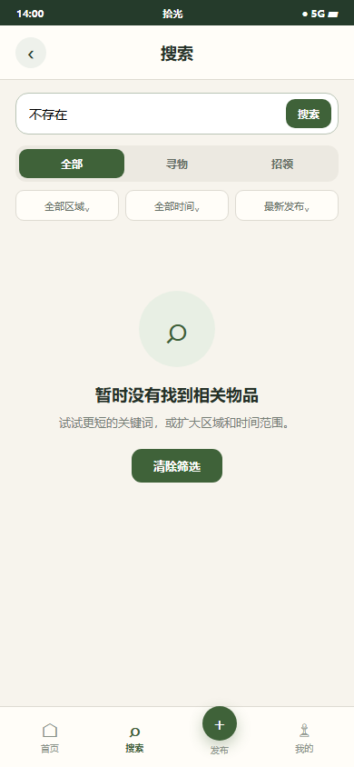
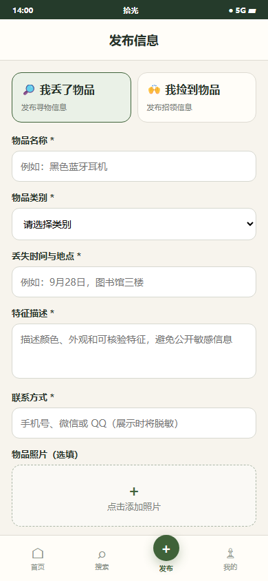
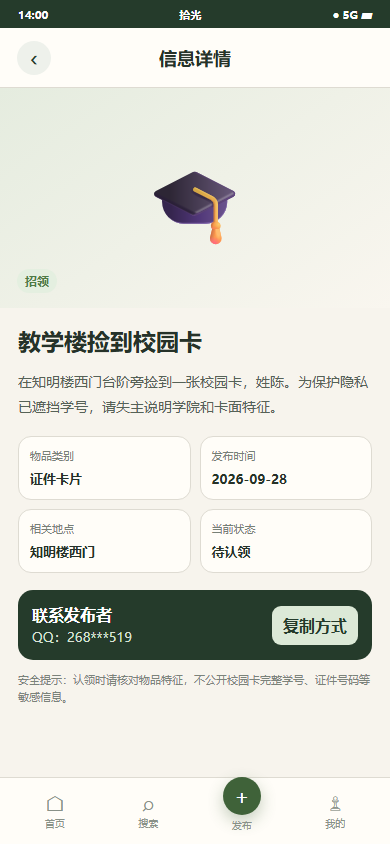
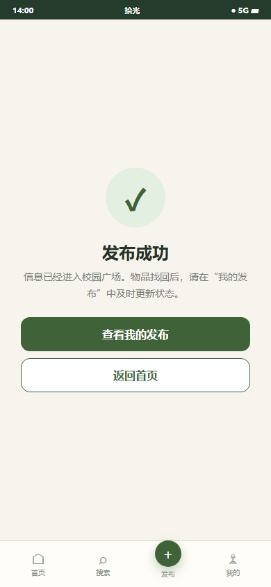
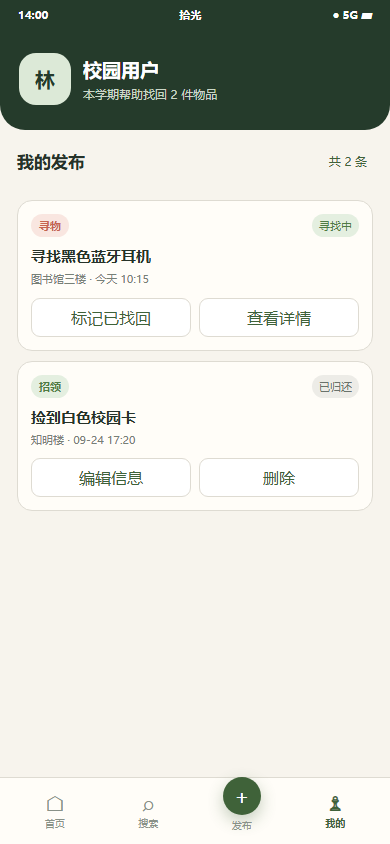

# 2026秋软件工程个人作业（三）：校园失物招领小程序

> 学号：`【同学A学号】`　姓名：`【同学A姓名】`  
> 学号：`【同学B学号】`　姓名：`【同学B姓名】`

## 一、阅读体会

阅读《构建之法》第3章和第8章之前，我们对软件开发的理解比较简单，认为只要把页面做出来、功能能够运行，就算完成了任务。阅读后我们发现，软件工程不仅是最后的代码和界面，还包括前期了解问题、安排时间、互相沟通、检查结果和不断修改。一个人的能力也不能只用掌握了多少工具来判断，更重要的是遇到问题时能否找到原因、按计划完成任务，并对自己的工作结果负责。

书中关于个人工作方法和结对合作的内容给我们留下了较深印象。结对并不是把任务平均分成两份后各做各的，而是两个人共同面对同一个问题：一人负责实际操作，另一人从旁检查思路、文字和遗漏之处，之后再交换。这样的方式虽然需要花时间交流，却能减少一个人反复修改的情况。本次作业中，我们也采用了“制作—检查—交换”的方式，一人调整原型，另一人按照普通用户的顺序点击，并记录不清楚的地方。

第8章让我们明白，用户说想要某个功能时，背后往往是一个更具体的困难。需求分析不能只列页面名称，而要弄清用户在什么情况下使用、希望解决什么问题。例如，丢失校园卡的同学真正需要的不是一个看起来丰富的软件，而是能快速看到相关招领信息；捡到物品的同学则需要方便地说明时间、地点和特征。原型可以在正式制作程序前把这些想法直观地展示出来，流程不顺或内容不清楚时也能尽早修改。因此，我们先确定真实使用场景，再设计页面和跳转，而不是一开始就追求页面数量。

## 二、需求分析

校园中遗失校园卡、钥匙、雨伞和耳机等物品的情况比较常见。目前，同学们通常在班级群、宿舍群或朋友圈发布消息，但不同学生所在的群并不相同，信息只能覆盖有限的人。一条招领消息还可能很快被新的聊天内容盖住，即使有人记得看过，重新翻找也很麻烦。信息分散、保存时间短和查找不方便，是这个小程序首先要解决的问题。

软件主要面向两类学生。第一类是丢失物品的同学，他们希望尽快发布寻物信息，并通过名称、地点等内容查找别人发布的招领信息。第二类是捡到物品的同学，他们希望用较少的步骤说明捡到的物品，让失主有机会看到并核对。两类用户虽然目的不同，但都需要一个集中浏览和搜索信息的入口，也需要清楚地知道一条信息现在是否仍然有效。

发布内容既要足够帮助判断，又不能让填写过程太麻烦。因此，我们把物品名称、时间、地点、特征和联系方式作为主要内容，照片可以根据实际情况选择添加。首页只显示名称、地点、时间和状态，方便快速浏览；进入详情页后再查看完整描述和经过隐藏处理的联系方式。这样可以减少无关信息，也能避免在首页直接展示过多个人内容。

信息发布后还需要有结束状态。物品已经找回或归还后，如果原信息仍显示为“寻找中”或“待认领”，其他同学可能继续联系发布者，也会影响搜索判断。因此，“我的发布”页面允许用户把状态改为“已找回”或“已归还”。讨论后，我们将浏览、发布、搜索、查看详情和修改状态定为主要功能，同时补充加载中、加载失败和搜索无结果等提示，使用户在不同情况下都知道接下来应该做什么。整体功能保持简单，也便于下一次作业按照原型进行实现。

## 三、功能与流程设计

软件包含浏览、搜索、发布、查看详情和修改信息状态五项主要功能。首页按“全部、寻物、招领”分类；搜索页支持关键词和最近搜索；发布页填写物品信息；详情页展示完整特征与隐藏部分内容的联系方式；“我的发布”负责更新处理状态。

主要流程为：进入首页 → 浏览或搜索 → 筛选结果 → 查看详情 → 联系发布者；进入发布页 → 选择类型 → 填写信息 → 发布成功 → 管理状态。

## 四、原型设计

原型设计工具为 **墨刀**，画布为 **390 × 844**。我们将页面导入墨刀并设置页面跳转，再逐条检查浏览、搜索、发布和修改状态的流程。

**在线原型展示：** [点击查看“校园失物招领小程序”墨刀原型](https://modao.cc/proto/N2e9WeMGtm2opg8Ru5mcP/sharing?view_mode=read_only&screen=rbpVWVNJVWVyzR5rXH7qRp)

页面颜色参考校园环境，以绿色和暖白色为主，并使用柔和的提示颜色。首页插画表现校园场景，信息卡片只显示名称、类型、地点、时间和状态；完整描述与联系方式放在详情页，避免首页内容太多。

### 关键状态说明

**加载中：** 使用骨架卡片保留列表结构，说明系统正在处理，而不是页面卡死。

**加载失败：** 与“没有结果”区分，说明网络异常，并提供重新加载入口。

**查找无结果：** 明确告诉用户搜索已完成，只是没有匹配信息，并建议更换关键词或清除筛选。

| 发布信息 | 信息详情 | 发布成功 | 我的发布 |
| --- | --- | --- | --- |
|  |  |  |  |

**发布信息：** 选择寻物或招领后填写名称、类别、时间地点、特征和联系方式，照片为选填。  
**信息详情：** 集中展示物品特征、地点、状态与隐藏部分内容的联系方式，方便核对后联系。  
**发布成功：** 反馈提交结果，并提供返回首页或查看个人发布的入口。  
**我的发布：** 管理发布内容，物品找回或归还后修改状态。

## 五、结对过程

我们先根据作业要求列出页面，再从“丢东西”和“捡东西”两个角度模拟实际操作。第一次讨论时，我们有过下面这段交流：

> 同学A：“首页是不是把所有信息都放上去？这样一打开就能看见。”  
> 同学B：“可以先显示名称、地点和时间，物品特征放到详情页，不然首页会太挤。”  
> 同学A：“那首页再分成全部、寻物和招领三类，找起来会更快。”  
> 同学B：“还要显示处理状态，已经找回的内容就不用继续联系了。”

确定首页后，我们继续梳理发布和搜索流程：

> 同学B：“发布页的内容太多会不会让人不想填？”  
> 同学A：“名称、时间、地点和联系方式必须填，照片与详细特征可以选填。”  
> 同学B：“搜索不到时不能只留一个空白页面，要明确告诉用户没有结果。”  
> 同学A：“那就单独做无结果页面，并提示更换关键词或清除条件。”

制作时，同学A负责首页、详情和发布页面，同学B负责搜索、我的发布和页面跳转。初版完成后，两人交换检查：一人按照普通用户的操作顺序点击，另一人记录问题。检查中发现发布完成后缺少明确去向，因此增加了“返回首页”和“查看我的发布”；搜索部分也补充了加载中、加载失败与无结果三种不同提示。最后，我们统一页面颜色、按钮文字和物品状态，并在墨刀中重新走完三条作业要求的流程。

> 博客发布前可在此处插入需求讨论截图、流程草稿或共同检查原型的照片，并隐藏无关个人信息。

## 六、PSP

| PSP阶段 | 预估/min | 同学A实际/min | 同学B实际/min |
| --- | ---: | ---: | ---: |
| 阅读任务、讨论与分工 | 40 | 45 | 40 |
| 需求分析与功能取舍 | 50 | 55 | 50 |
| 用户流程与页面规划 | 60 | 65 | 70 |
| 原型制作与页面跳转 | 240 | 250 | 230 |
| 检查、修改与博客整理 | 100 | 110 | 105 |
| 合计 | 490 | 525 | 495 |

## 七、个人总结

**同学A：** 这次作业让我认识到，原型设计不是简单地把几个页面画出来，而是要先想清楚用户为什么使用、每一步需要看到什么。我最开始想在首页放入尽可能多的信息，认为内容越全越方便，但实际排版后发现，文字太多会让用户难以快速找到重点。经过讨论，我们只在卡片中保留名称、地点、时间和状态，把详细特征放到详情页，页面清楚了很多。这次修改让我明白，增加内容不一定能让软件更好，合适的取舍同样重要。

制作过程中，我还发现按钮名称和下一步去向都需要明确。例如，发布成功不能只显示一句“成功”，还应该告诉用户可以返回首页或查看自己的发布；加载失败也不能与搜索无结果使用相同提示，否则用户不知道是网络问题还是确实没有信息。我负责制作页面时，常常会因为熟悉自己的设计而忽略这些问题，同伴按照第一次使用的方式检查后，能够更快发现不清楚的地方。PSP记录也让我看到，原型制作和后期修改的实际时间超过了原来的估计，以后安排任务时应该为检查和修改留出更多时间。

**同学B：** 我的主要收获是学会从真实使用过程出发安排功能。以前看到作业要求时，我可能会直接按照页面清单开始制作；这次我们先模拟了丢失校园卡和捡到雨伞的情况，再思考用户从进入首页到找到信息需要经过哪些步骤。这样整理后，每个页面存在的原因更加清楚。例如，搜索页面帮助用户缩小查看范围，详情页面负责核对特征，“我的发布”则让已经结束的信息及时改变状态，而不是为了增加页面数量才加入它们。

在检查原型时，我原本比较关注页面颜色和排列是否整齐，后来发现完整的操作过程更加重要。搜索不到内容、页面加载失败、发布后不知道去哪里，这些问题在单独的页面截图里不明显，却会让实际使用过程停下来。我在检查同学A页面时提出了修改意见，对方也发现我的搜索页面中有些跳转不够清楚。两个人互相说明理由、再一起修改，比各自完成后简单合并更有效。这次结对让我感受到沟通和检查并不是额外负担，而是完成作业的一部分，也为下一次把这些页面做成实际程序准备了更明确的内容和顺序。
