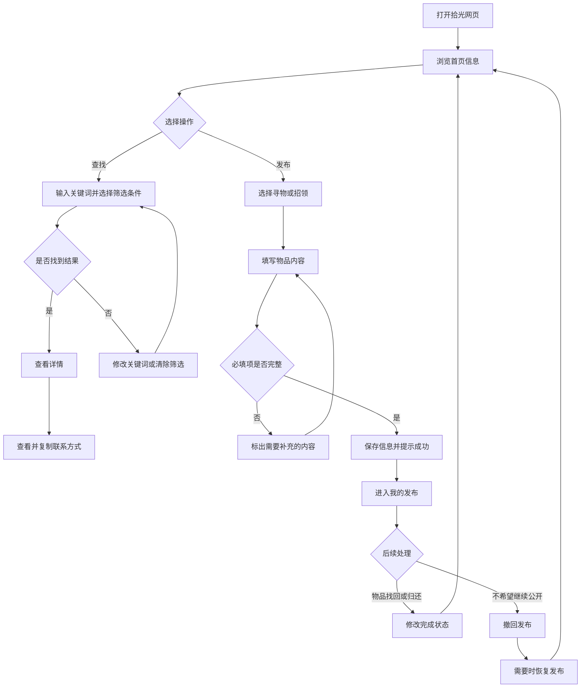

# 2026秋软件工程结对作业（第二次）：拾光校园失物招领

| 作业信息 | 内容 |
| --- | --- |
| 所属课程 | 【填写课程班级】 |
| 作业要求 | 【粘贴本次作业链接】 |
| 作业目标 | 在上一次原型基础上，实现一个可以实际操作的校园失物招领 Web 程序 |
| GitHub仓库 | [102401513-102401514](https://github.com/mclennonwyms-art/102401513-102401514) |
| 结对成员 | 【学号A—姓名A】、【学号B—姓名B】 |
| 两人博客 | [同学A博客]()、[同学B博客]() |

> 本文中的姓名、学号、博客链接、GitHub地址、开发截图和提交记录需要在发布前替换为真实内容。

## 一、项目概况

这次作业延续了第一次结对作业中的“拾光”原型。第一次作业主要解决页面应该有哪些内容、用户怎样完成操作等问题；本次作业则需要把原型转换为真正可以点击和保存数据的网页。

项目围绕下面这条主要流程展开：

> 发布寻物或招领信息 → 首页浏览或搜索 → 查看物品详情 → 获取发布者联系方式 → 物品找回或归还 → 更新信息状态

在此基础上，我们增加了类别与区域筛选、联系方式隐藏与复制、可恢复的撤回、搜索记录和浏览器本地保存。网页没有连接服务器，其他同学下载完整项目后，可以直接使用谷歌浏览器打开 `dist/index.html`。

### 开发环境

| 项目 | 使用内容 |
| --- | --- |
| 操作系统 | Windows |
| 运行浏览器 | Google Chrome |
| 页面技术 | HTML、CSS、原生JavaScript |
| 数据保存 | 浏览器localStorage |
| 自动化测试 | Node.js内置的node:test、node:assert |
| 版本管理 | Git、GitHub、Pull Request |

> 【此处插入程序首页截图】

## 二、结对分工与合作方式

我们没有简单地把页面平均分开后各做各的，而是先共同确定信息字段和操作流程，再分别实现页面与数据逻辑，最后交换检查。

| 成员 | 主要任务 |
| --- | --- |
| 同学A | 首页、详情页、发布页、整体样式、联系方式查看与复制、浏览器数据保存 |
| 同学B | 搜索与组合筛选、“我的发布”、状态修改、撤回与恢复、自动化测试、README |
| 共同完成 | 功能讨论、字段确定、页面联调、异常情况检查、GitHub合并、博客整理 |

协作时，我们尽量按照一个功能一次提交的方式记录进展。例如完成搜索后单独提交，完成撤回功能后再次提交。另一位同学通过Pull Request检查修改内容，再合并到主分支。这样出现问题时比较容易找到对应修改，也能避免两个人同时改动同一部分造成混乱。

## 三、PSP记录

| PSP阶段 | 预估/min | 同学A实际/min | 同学B实际/min |
| --- | ---: | ---: | ---: |
| 阅读要求、讨论分工 | 40 | 45 | 40 |
| 检查原型、整理功能 | 60 | 70 | 65 |
| 页面结构与样式 | 180 | 200 | 170 |
| 发布、搜索和详情功能 | 240 | 270 | 250 |
| 数据保存与状态修改 | 100 | 120 | 115 |
| 撤回与恢复功能 | 50 | 65 | 70 |
| 编写和运行单元测试 | 100 | 120 | 130 |
| 浏览器检查与修改 | 80 | 110 | 100 |
| README与博客整理 | 100 | 120 | 125 |
| 合计 | 950 | 1100 | 1065 |

实际时间比预计时间多，主要增加在功能检查和修改阶段。最初我们只关注顺利完成操作，后来又补充了表单缺项、搜索不到结果、修改他人信息、重复更新状态、撤回后恢复等情况。测试数量增加后，测试数据的准备和问题排查也花费了更多时间。

## 四、程序设计与实现

### 4.1 整体组织方式

程序分成页面显示和核心数据处理两部分：

```text
用户点击页面
      ↓
app.js：显示页面、处理按钮和表单
      ↓
core.js：校验、搜索、筛选、状态修改、撤回
      ↓
localStorage：保存所有失物招领信息
```

首页、搜索、详情和“我的发布”不会各自保存一套信息，而是读取同一个 `items` 列表。当一条信息的状态发生变化时，保存新的列表，再重新显示当前页面，因此不同页面看到的结果能够保持一致。

### 4.2 信息数据格式

每条信息使用相同的字段保存：

```javascript
{
  id: "item-001",
  type: "lost",
  title: "寻找黑色蓝牙耳机",
  category: "数码产品",
  area: "图书馆",
  eventDate: "2026-10-07",
  place: "图书馆三楼东侧",
  desc: "黑色充电盒右下角有轻微划痕",
  contact: "微信：example2026",
  status: "寻找中",
  owner: true,
  withdrawn: false,
  createdAt: "2026-10-07T10:15:00+08:00"
}
```

其中，`type` 用于区分寻物和招领，`owner` 表示是否为当前用户发布，`withdrawn` 表示信息是否已经撤回。只有 `owner` 为 `true` 的信息才能修改状态或撤回。

### 4.3 核心操作流程



### 4.4 发布与表单检查

发布页面要求填写信息类型、物品名称、类别、区域、日期、具体地点、物品特征和联系方式。提交时先调用 `validateItem()` 检查内容。如果有缺项，页面会在对应输入框下显示提示，并保留用户已经填写的内容；全部通过后才创建新信息。

寻物信息的初始状态是“寻找中”，招领信息的初始状态是“待认领”。信息保存成功后，会出现在首页、搜索结果和“我的发布”中。

### 4.5 搜索和组合筛选

搜索不只检查标题，还会同时检查类别、区域、地点和特征描述。用户还可以继续选择寻物或招领、物品类别和校园区域。

```javascript
function filterItems(items, filters) {
  const query = normalizeText(filters.query);

  return [...items]
    .filter(item => filters.includeWithdrawn || !item.withdrawn)
    .filter(item => !query || normalizeText([
      item.title,
      item.category,
      item.area,
      item.place,
      item.desc
    ].join(" ")).includes(query))
    .filter(item =>
      !filters.type ||
      filters.type === "all" ||
      item.type === filters.type
    )
    .filter(item =>
      !filters.category ||
      filters.category === "全部类别" ||
      item.category === filters.category
    )
    .filter(item =>
      !filters.area ||
      filters.area === "全部区域" ||
      item.area === filters.area
    );
}
```

这里的多个条件是同时满足的关系。例如搜索“耳机”，选择“寻物”和“图书馆”后，只有同时符合三个条件的信息才会显示。已经撤回的信息默认不会进入首页与搜索结果。

### 4.6 详情和联系方式

用户点击信息卡片后，程序根据 `id` 找到对应记录，展示物品类别、日期、地点、区域、特征和状态。联系方式默认只显示一部分，点击“查看”后显示完整内容，再次点击可以复制。

由于网页可以直接通过本地文件打开，部分浏览器可能限制新的剪贴板功能，所以程序同时准备了普通文本框复制方式。当新的复制方法不可用时，会自动使用备用方式。

### 4.7 状态修改

状态修改会检查三件事：信息编号是否匹配、是否为当前用户发布、信息是否已经结束。检查通过后，寻物信息改为“已找到”，招领信息改为“已归还”。

```javascript
function updateItemStatus(items, id) {
  let changed = false;

  const next = items.map(item => {
    if (
      String(item.id) !== String(id) ||
      !item.owner ||
      isDone(item)
    ) return item;

    changed = true;
    return {
      ...item,
      status: DONE_STATUS[item.type]
    };
  });

  return { changed, items: next };
}
```

### 4.8 可恢复的撤回

撤回不是直接删除数据。发布者确认撤回后，程序把状态改为“已撤回”，并保存撤回前的状态。首页和搜索会隐藏这条信息，但“我的发布”仍然保留记录。

```javascript
function withdrawItem(items, id) {
  let changed = false;

  const next = items.map(item => {
    if (
      String(item.id) !== String(id) ||
      !item.owner ||
      item.withdrawn
    ) return item;

    changed = true;
    return {
      ...item,
      previousStatus: item.status,
      status: "已撤回",
      withdrawn: true
    };
  });

  return { changed, items: next };
}
```

需要重新公开时，点击“恢复发布”，程序会读取 `previousStatus`，恢复到撤回之前的状态。这样既满足撤回需求，又能避免误操作后必须重新填写全部内容。

## 五、附加设计与页面展示

### 5.1 类别和校园区域筛选

当信息数量增加时，只搜索“卡”或“钥匙”可能得到很多结果。类别和区域可以进一步缩小范围，减少逐条查看所花费的时间。

> 【插入搜索结果及筛选截图】

### 5.2 联系方式隐藏与一键复制

联系方式不会直接出现在首页，详情页中也先隐藏一部分。用户确认物品特征后再查看并复制，在方便联系的同时减少不必要的公开展示。

> 【插入详情页查看联系方式截图】

### 5.3 可恢复撤回

信息发错、重复发布或者暂时不希望公开时，可以主动撤回。撤回内容不会继续出现在公共列表，但可以从“我的发布”恢复，比直接删除更加稳妥。

> 【插入撤回前、撤回后和恢复后的截图】

### 5.4 操作反馈

程序还提供了表单错误提示、搜索无结果提示、状态修改提示、发布成功页面和撤回确认框。用户进行操作后能够知道是否成功，以及下一步应该做什么。

## 六、项目目录与运行方法

### 6.1 目录结构

```text
campus-lost-found-prototype/
├─ dist/
│  ├─ index.html                 网页入口
│  └─ assets/
│     ├─ app.js                  页面显示和按钮操作
│     ├─ core.js                 搜索、检查、状态及撤回逻辑
│     ├─ style.css               页面样式和屏幕适配
│     └─ campus-hero-v3.png      首页图片
├─ tests/
│  └─ core.test.js               21项自动化测试
├─ docs/
│  ├─ TEST_REPORT.md             测试用例说明
│  └─ 第二次结对作业博客.md      本文Markdown文件
└─ README.md                     项目介绍、目录和运行说明
```

### 6.2 打开网页

1. 从GitHub下载并解压完整项目。
2. 进入 `dist` 文件夹。
3. 使用Google Chrome打开 `index.html`。
4. 从底部按钮进入首页、搜索、发布和“我的发布”。

网页不需要安装数据库，也不需要执行npm命令。数据只保存在当前浏览器中。若想清除自己添加的数据，可以进入“我的发布”点击“恢复示例”。

### 6.3 运行测试

安装Node.js 18或更高版本后，在项目根目录执行：

```bash
node --test tests/core.test.js
```

测试使用Node.js自带工具，不需要另外执行 `npm install`。

## 七、单元测试设计

### 7.1 为什么选择Node.js内置测试工具

本项目没有使用第三方框架，为了让测试人员下载项目后尽量少安装其他内容，我们选择了Node.js自带的 `node:test` 和 `node:assert`。`test()` 用于说明测试情况，`assert.equal()` 和 `assert.deepEqual()` 用于比较实际结果和预期结果。

一个最简单的例子：

```javascript
const test = require("node:test");
const assert = require("node:assert/strict");

test("寻物信息初始状态为寻找中", () => {
  const result = Core.createItem(validLostItem);
  assert.equal(result.item.status, "寻找中");
});
```

### 7.2 测试内容

| 测试范围 | 用例数量 | 主要情况 |
| --- | ---: | --- |
| 搜索与筛选 | 6 | 名称、地点、大小写、类型、类别与区域组合、排序 |
| 表单与创建 | 4 | 空表单、描述过短、创建寻物、创建招领 |
| 状态和权限 | 3 | 正常完成、修改他人信息、重复修改 |
| 联系方式与输入处理 | 2 | 手机号隐藏、特殊字符转换 |
| 搜索记录 | 2 | 去重、数量限制 |
| 撤回与恢复 | 4 | 正常撤回、禁止撤回他人信息、公开列表隐藏、恢复原状态 |
| 合计 | 21 | 21项全部通过 |

### 7.3 根据程序分支设计测试

状态修改和撤回功能包含多个判断，因此我们根据代码里的不同情况分别准备测试：

```text
找到指定信息？
├─ 否：不修改
└─ 是
   ↓
属于当前用户？
├─ 否：拒绝操作
└─ 是
   ↓
已经结束或撤回？
├─ 是：拒绝重复操作
└─ 否：保存新的状态
```

例如，测试“不能撤回其他人的信息”：

```javascript
test("不能撤回其他人发布的信息", () => {
  const result = Core.withdrawItem(sampleItems, "1");
  assert.equal(result.changed, false);
});
```

除了正常情况，我们还准备了空内容、过短描述、不存在的关键词、多个筛选条件、重复搜索、他人信息和已经结束的信息。这样可以检查测试人员故意漏填、重复点击或输入特殊内容时，程序是否仍能给出合理结果。

### 7.4 测试结果与不足

2026年10月8日运行结果：

```text
tests 21
pass  21
fail  0
```

这些测试覆盖了主要数据处理函数，但仍不能代替浏览器中的完整操作。我们又在Chrome中人工检查了发布、搜索、详情、复制联系方式、更新状态、撤回和恢复流程。

目前项目的数据保存在单个浏览器中，因此没有涉及多用户同时操作、服务器接口、数据库和网络中断测试。如果以后增加后端，这些部分还需要重新设计和测试。

> 【此处插入命令行测试结果截图】

## 八、GitHub协作和提交记录

我们采用下面的协作顺序：

```text
同步最新main
    ↓
建立自己的功能分支
    ↓
完成一个功能并测试
    ↓
Commit和Push
    ↓
创建Pull Request
    ↓
队友检查后合并
```

提交说明尽量写清楚修改内容，例如：

```text
feat: 完成发布表单和本地保存
feat: 增加关键词、类别和区域筛选
feat: 实现我的发布与状态修改
feat: 增加可恢复的撤回功能
test: 补充撤回、权限和恢复测试
docs: 更新README和测试说明
```

我们避免使用“改了一下”“最终版”“111”等无法说明实际内容的提交名称。

> 【插入真实GitHub Commit截图】  
> 【插入真实Pull Request截图】

## 九、开发过程中遇到的问题

### 问题一：表单提示错误后，已经填写的内容消失

**问题描述：** 第一版在发现必填项不完整时会重新显示发布页面，但重新显示后，用户已经填写的正确内容也会被清空。

**尝试过程：** 我们先考虑只在原页面增加错误文字，但多个输入框同时出错时处理比较零散。后来决定在提交时保存一份当前表单内容。

**解决方法：** 增加 `formDraft`。检查失败时保存当前输入，再使用这些内容重新显示表单，只在对应位置显示错误提示。

**结果与收获：** 问题已经解决。我们认识到错误提示不能只告诉用户哪里错了，还要避免让用户重新填写本来正确的部分。

### 问题二：直接打开本地网页时复制功能可能受限制

**问题描述：** 新的Clipboard API在部分本地文件环境中无法正常使用，如果只调用这一种方法，用户点击复制后可能没有结果。

**尝试过程：** 我们检查了浏览器权限和不同打开方式，发现课程要求允许直接打开HTML，因此不能要求测试人员为了复制功能再启动服务器。

**解决方法：** 优先使用Clipboard API；调用失败时，临时创建文本框、选中联系方式并使用备用复制方法。

**结果与收获：** 复制功能在不同打开方式下更加稳定。实现功能时不仅要考虑开发时的环境，也要考虑助教按照README运行时的环境。

### 问题三：撤回后是删除还是保留

**问题描述：** 如果直接删除，误操作后无法恢复；如果只把状态改成“已撤回”，又必须保证公共页面不再显示。

**尝试过程：** 我们比较了直接删除和保留记录两种方案，并按照用户操作后是否容易补救进行选择。

**解决方法：** 使用可恢复撤回。撤回时记录原状态，公共浏览与搜索过滤撤回内容，“我的发布”继续显示，并提供恢复按钮。

**结果与收获：** 撤回和恢复流程已经完成，并增加了4项相关测试。对于可能误点的操作，保留恢复机会比直接删除更稳妥。

## 十、功能完成情况

| 编号 | 功能 | 完成情况 |
| --- | --- | --- |
| F01 | 首页浏览及寻物、招领分类 | 已完成 |
| F02 | 发布寻物信息 | 已完成 |
| F03 | 发布招领信息 | 已完成 |
| F04 | 关键词搜索 | 已完成 |
| F05 | 类别和区域组合筛选 | 已完成 |
| F06 | 查看详细信息 | 已完成 |
| F07 | 查看与复制联系方式 | 已完成 |
| F08 | 我的发布 | 已完成 |
| F09 | 标记已找到或已归还 | 已完成 |
| F10 | 撤回与恢复发布 | 已完成 |
| F11 | 浏览器本地保存 | 已完成 |
| F12 | 表单错误和无结果提示 | 已完成 |
| F13 | 21项自动化测试 | 已完成 |

程序目前能够走通完整流程：

> 发布 → 首页浏览或搜索 → 查看详情 → 获取联系方式 → 我的发布 → 更新状态或撤回 → 各页面同步变化

## 十一、队友评价

### 值得学习的地方

队友在制作和检查页面时比较认真，能够根据第一次原型保持整体颜色和页面顺序，也愿意按照测试发现的问题反复调整。在两个人负责内容不同的情况下，遇到接口或字段变化会及时说明，减少了合并时的冲突。尤其是在检查发布和搜索流程时，能够以第一次使用网页的角度发现文字不清楚、按钮去向不明确等问题。

### 可以继续改进的地方

前期对测试和修改所需时间估计得比较少，导致后面集中补充了较多异常情况。以后可以在确定功能时同时列出正常情况和失败情况，完成一个功能就交换检查，而不是等主要页面全部完成后再统一检查。提交代码时也可以在说明中写清修改的文件和验证方法，方便对方更快完成检查。

## 十二、个人总结

与第一次作业只展示原型相比，这次最大的变化是页面中的内容真正可以被保存和修改。以前看到原型中的“发布成功”“搜索结果”和“已找到”时，会觉得只要把对应页面做出来就可以；真正实现后才发现，这些页面背后还需要处理表单检查、数据保存、编号查询、筛选条件、权限判断和多个页面之间的同步。

我在这次作业中更加明显地体会到，程序能够打开并不代表功能已经可靠。例如发布表单提示错误后不能清空正确内容，撤回后不能继续出现在搜索结果里，其他人发布的信息不能被当前用户修改，已经结束的信息也不能反复更新。这些情况不一定会在第一次点击时出现，却会直接影响程序是否方便使用。

GitHub协作也让我对分支、提交和Pull Request有了更具体的认识。两个人合作时，清楚的文件分工和提交说明非常重要。每完成一个功能就测试和提交，比最后把大量代码一次放上去更容易检查。通过对方的检查，也能发现自己因为太熟悉代码而忽略的问题。

单元测试是另一个比较大的收获。以前测试更多是打开程序点几下，这次我们把搜索、表单检查、状态修改和撤回等逻辑单独放在 `core.js` 中，为正常输入、错误输入和边界情况分别编写测试。21项测试不能证明程序完全没有问题，但至少让每次修改以后都能快速确认原有功能有没有被破坏。

目前项目仍然是保存在本地浏览器中的课程作业版本，不同电脑之间不能共享数据。如果以后继续完善，可以增加真正的服务器和数据库，让校园内不同用户看到相同信息。不过对于本次作业，我们更希望先把发布、查找、联系、更新状态和撤回这些主要流程做完整、做清楚。

## 结语

这次结对编程让我们从“页面应该是什么样”进一步走到了“数据如何变化、异常如何处理、两个人怎样共同完成代码”。最终的网页仍然有继续完善的空间，但已经能够按照README直接运行，并完成作业要求中的主要使用流程。
